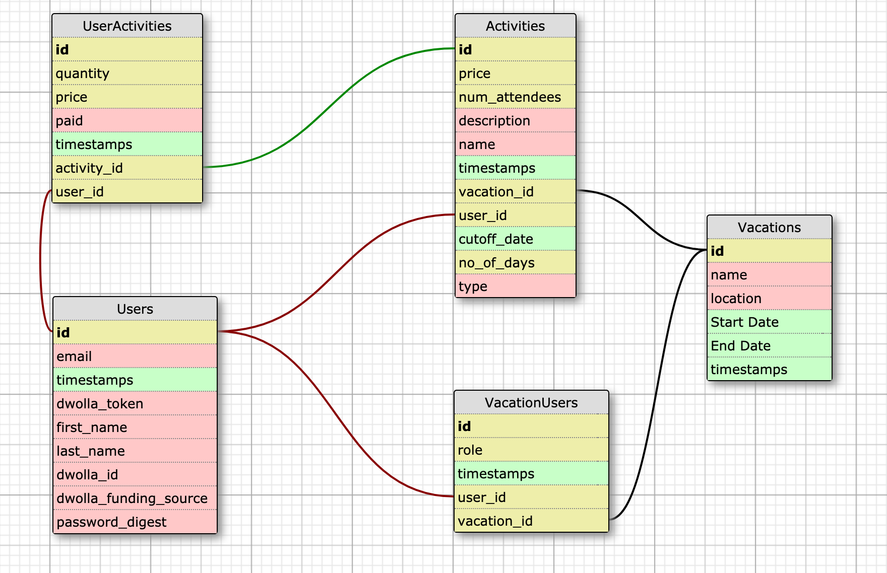

# README

## Table of Contents

- [Introduction](#introduction)
- [Initial Setup](#initial_setup)
- [How to Use](#how_to_use)
- [Testing](#testing)
- [How to Contribute](#how_to_contribute)
- [Core Contributors](#core_contributors)
- [Tech Stack](#tech_stack)

## Introduction

VacayPay is a group project that was created as part of The Turing School of Software and Design's Backend Engineering Program.  The application provides a means for a person to create a vacation, add participants and activities to the vacation, and also provide functionality so that the costs for the vacation are distributed correctly for each participant.

## Initial Setup

Clone this repository to your computer.  Once it has been cloned, run `bundle`.  After bundling, run `rake db:{create,migrate,seed}`.

## How to Use

To run the app locally, run `rails s`, and then navigate to `localhost:3000`.  From the welcome page, the user can then click on the `Register` link if they are an unregistered user, or go the `Log In` link to sign in if they are a registered user.

A logged-in registered user can go to the `My Vacations` tab to view their upcoming vacations.  This page will show the vacations and information about each vacation such as location, who the host is, and amounts owed/owing.  Each of the listed vacations has a link, `View Vacation`, that leads to a show page for that individual vacation.  

The individual vacation show page shows more details about the vacation, such as what activities are planned and who is partaking in the activities.  There are also links for adding a new activity, and for adding participants.  

The vacation show page also shows a `Settle Up` button for the activities that the user owes money on.  The amount owed is displayed by the `Settle Up` button.  Once the user clicks on the button, their funds are directed to the person who is owed money.

A logged-in registered user can also click the `Create A Vacation` link in the navbar, which will redirect to a form where a new vacation can be created.  Once the information is submitted, the user is directed to a page where one can add an activity or invite participants.

A logged-in registered user has access to their profile page via a `Profile` link at the top of the page.  The profile page shows information such as the user's email address and the bank account that they are using for the peer-to-peer payment functions.

A non-registered user will be directed to a registration page.  This page takes in the basic information of first name, last name, email address and password.  Once the user completes this page, they are registered with the site.  They will still need to connect their payment information, however.  They will see a button to `Connect to Dwolla`.  

Clicking on `Connect to Dwolla` will bring up a form that gathers the necessary information required by the Dwolla service.  When that information is entered, the user will be connected with Dwolla.  The last step will be for the user to click on the `Add My Bank Account` button.  This button will lead to a pop-up window that allows the user to enter in their banking information via a secure service from Dwolla.  Once this step is completed, the user is fully registered with the application.

## Testing

The application was created with RSpec.  To run the test suite, enter `rspec` from the command line.  

SimpleCov was used for monitoring testing coverage.  VCR was used to record the results of API calls, and to limit the number of actual calls that had to be made.

The application uses the Dwolla payment service.  Dwolla provides a robust sandbox environment for developers to test their applications.  This application was developed entirely in that sandbox environment.

## How to Contribute

If you would desire to contribute to the project, fork the project from the master branch.  You can then make the changes you think are appropriate and submit a pull request.  Please provide a detailed explanation in the pull request of what the problem or fix is.  

## Core Contributors

VacayPay was a four person project.  The team members were Chi Tran, Earl Stephens, Ethan Grab and Jalena Taylor.  Their GitHub links are:

Chi: [https://github.com/chitasan]
Earl: [https://github.com/earl-stephens]
Ethan: [https://github.com/Stoovles]
Jalena: [https://github.com/jalena-penaligon]

## Tech Stack

This application was built using Ruby version 2.4.1 and Ruby on Rails version 5.2.3.  PostgreSQL version 11.1 was used for the database.  

The database consists of 5 tables.  The schema is shown below:

